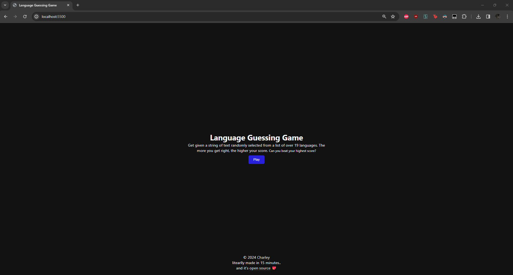
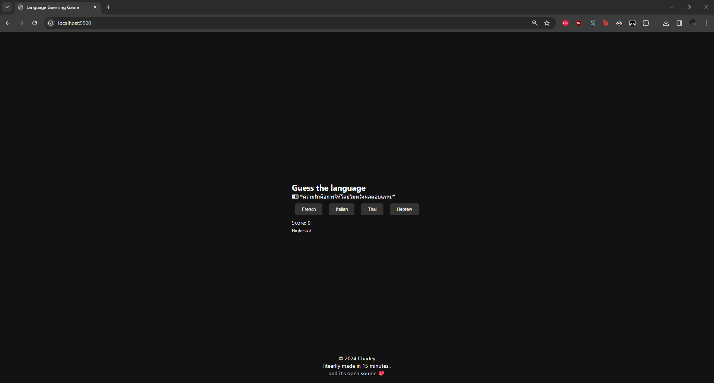

# Language Guessing Game

Welcome to the Language Guessing Game! This simple yet engaging game challenges you to identify the language of a given quote from four possible options. Designed and developed in just 15 minutes, this game aims to test your linguistic skills and offer a fun way to learn about different languages.

## Features

- **Random Quotes:** Each game round presents you with a randomly selected quote to keep the game exciting and unpredictable.
- **Multiple Language Options:** Choose the correct language from four options, testing your knowledge and intuition about various languages.
- **Instant Feedback:** After making your choice, the game immediately tells you whether you guessed correctly, allowing for quick learning and improvement.
- **Score Tracking:** Keep track of your correct guesses and aim to beat your high score with each new round.

## How to Play

Playing the Language Guessing Game is straightforward:

1. **Visit the website** - seen [here](https://language-guessing-game.pages.dev)
2. **Start** - Click "Play"

## Screenshots

The Home Screen

The Game

## Contributing

Contributions are always welcome. If you have suggestions for improving the game, find a bug, or want to add more quotes or languages, please feel free to fork the repository and submit a pull request.

## Acknowledgements
Special thanks to [Pixabay](https://pixabay.com/) for providing all sounds seen in the game.